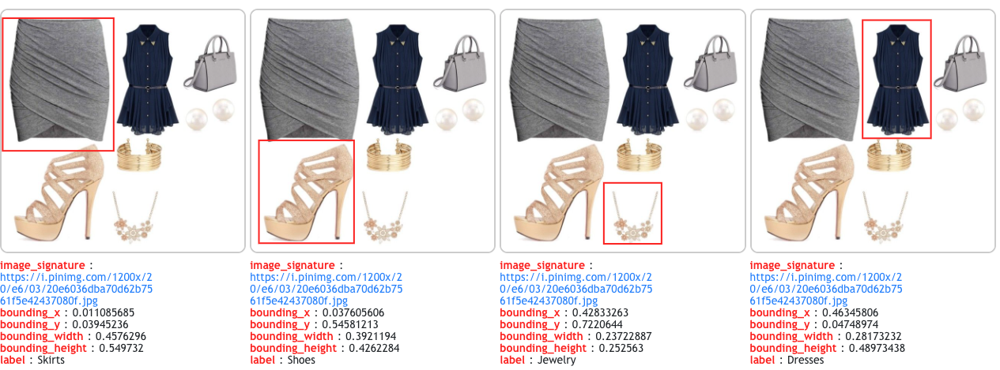

# Complete The Look Dataset

This repository contains the **Pinterest Complete The Look data** used in the following paper:
[TODO: insert arxiv link] (KDD 2020)

We include 10% of the training dataset and the entire test dataset.
Please remember to cite our paper if you find these datasets useful.

## Stats
#### Overall
|                       | train      | test       |
|-------------------    |--------    |--------    |
| # outfits             | 107,895     | 24,960      |
| # fashion objects     | 454,351     | 109,471     |
| # categories          | 21         | 21         |

#### Number of items per category (top 10)
| label               | train      | test       |
|-----------------    |--------    |--------    |
| Shoes               | 94,059     | 22,728     |
| Handbags            | 88,955     | 20,729     |
| Shirts & Tops       | 57,250     | 14,451     |
| Pants               | 51,706     | 11,666     |
| Coats & Jackets     | 43,552     | 9,698      |
| Dresses             | 28,066     | 6,903      |
| Jewelry             | 24,409     | 7,813      |
| Hats                | 18,581     | 4,343      |
| Skirts              | 15,152     | 3,630      |
| Sunglasses          | 9,343      | 2,174      |

#### Number of outfits with # items
| #items     | train      | test      |
|--------    |--------    |-------    |
| 3          | 24,545     | 5,383     |
| 4          | 46,545     | 9,288     |
| 5          | 27,643     | 6,616     |
| 6          | 7,927      | 2,786     |
| 7          | 1,127      | 722       |
| 8          | 102        | 165       |

Please refer to paper for more details about the full dataset and how it was generated.

## Format
The datasets are provided in `TSV` format. We have two different versions:
1) Raw dataset with header (train and test):
`(image_signature, bounding_x, bounding_y, bounding_width, bounding_height, label)`

2) Triplet dataset with header (train only):
`(image_signature_anchor, bounding_x_anchor, bounding_y_anchor, bounding_width_anchor, bounding_height_anchor, label,
image_signature_pos, bounding_x_pos, bounding_y_pos, bounding_width_pos, bounding_height_pos, label,
image_signature_neg, bounding_x_neg, bounding_y_neg, bounding_width_neg, bounding_height_neg, label)`

Each image is a collage outfit and each bounding_box represents an item. Multiple rows with the same image_signature contain items from the same outfit.

In addition, we've also included the FITB questions created from the raw test dataset in `JSON` format (correct answer at index=0):

```
[
    {
        "question": [
            {
                "h": "0.3547391", 
                "label": "Handbags", 
                "w": "0.29715955", 
                "signature": "0139dbef9bcc82bbe4875894cc118132", 
                "y": "0.27341554", 
                "x": "0.547215"
            }, 
            {
                "h": "0.95822084", 
                "label": "Dresses", 
                "w": "0.48265392", 
                "signature": "0139dbef9bcc82bbe4875894cc118132", 
                "y": "0.041779168", 
                "x": "0.038041957"
            }
        ], 
        "answers": [
            {
                "h": "0.24204975", 
                "label": "Shoes", 
                "w": "0.33648607", 
                "signature": "0139dbef9bcc82bbe4875894cc118132", 
                "y": "0.74930716", 
                "x": "0.48908612"
            }, 
            {
                "h": "0.3023045", 
                "label": "Shoes", 
                "w": "0.3168704", 
                "signature": "01ce612ba639a9e58f35564856b25a9a", 
                "y": "0.6709938", 
                "x": "0.5058815"
            }, 
            {
                "h": "0.40008748", 
                "label": "Shoes", 
                "w": "0.33582115", 
                "signature": "009a5a4515b81f4ce540d35ba67798e4", 
                "y": "0.57832766", 
                "x": "0.6554655"
            }, 
            {
                "h": "0.1563462", 
                "label": "Shoes", 
                "w": "0.32547513", 
                "signature": "0113f546bcd41284aeb99d961eacbff3", 
                "y": "0.75990874", 
                "x": "0.091433905"
            }
        ]
    }
    ...
```

#### image_signature
The images are represented by a signature, and the corresponding image URL can be obtained via:
```python
def convert_to_url(signature):
    prefix = 'http://i.pinimg.com/400x/%s/%s/%s/%s.jpg'
    return prefix % (signature[0:2], signature[2:4], signature[4:6], signature)
```

#### bounding_box
The bounding box coordinates are given as normalized values. The coordinates of the top left corner in `(0, 0)` and a bounding box around the entire image would be `(0, 0, 1, 1)`. The bounding box absoluate coordinates are given by: 
```python
        im_w, im_h = image.size
        box = (x * im_w, y * im_h, (x + width) * im_w, (y + height) * im_h)
```

## Sampling triplets
Triplets are sampled from the raw dataset by sampling `(anchor, pos, neg)` where `<anchor, pos>` belong to the same outfit but different categories and `<pos, neg>` belong to different outfits but the same category. Negatives are sampled randomly under these restraints.


## Examples


